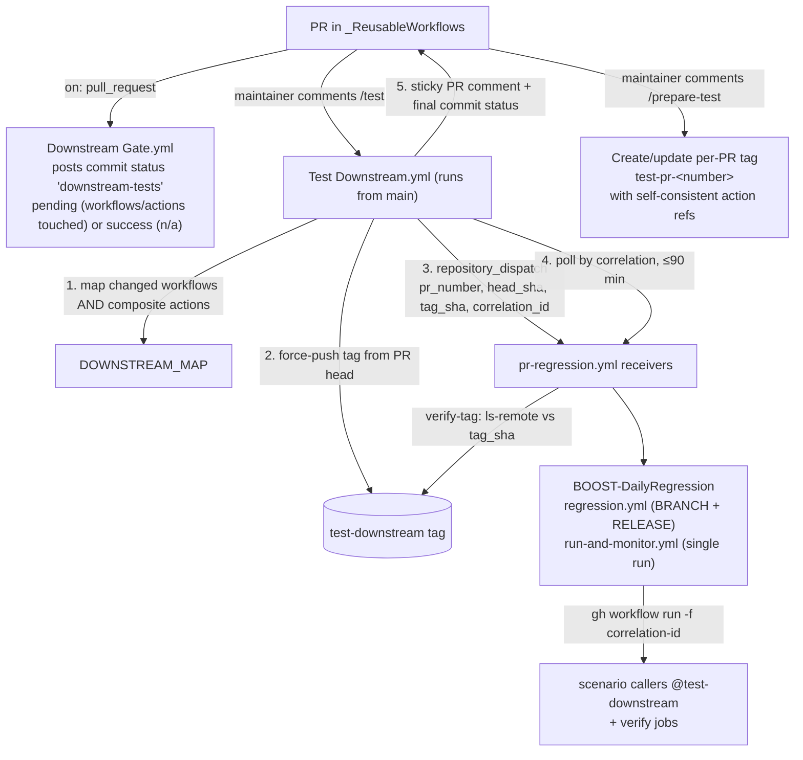

# Downstream integration-test battery

How changes to the reusable workflows in this repository are integration-tested
against real consumer repositories before they reach the fleet.

## What a green battery means

> When the complete battery passes for a PR, existing consumers, supported
> inputs, the important execution contexts (branch, tag/release, pull_request),
> failure behavior, and the critical side effects (packages, artifacts, catalog
> registrations) of the reusable workflows still work.

## Architecture



- **Gating**: `downstream-tests` is a commit status on the PR head SHA. Every
  push resets it (the gate re-runs), so a stale green can never carry over.
  Configured as a required check, a PR touching `.github/workflows/**` or
  `.github/actions/**` cannot merge without a passing `/test` battery.
- **Correlation**: the orchestrator's `correlation_id` flows into every
  dispatched run's `run-name`. Monitors locate runs by that id — never "the
  most recent run" — so concurrent activity cannot cross-attribute results.
- **Serialization**: `Test Downstream.yml` uses a queued concurrency group and
  holds it for the full battery, keeping the mutable `test-downstream` tag
  stable. Receivers additionally verify the tag SHA against the dispatch
  payload and fail closed if another battery overwrote it.
- **Fork PRs** are rejected by the battery (and the gate cannot post statuses
  for them) — merge stays blocked until the branch is pushed internally.

## Preparing a ref for manual testing

Comment `/prepare-test` on an internal PR to create or update a persistent
`test-pr-<number>` tag without starting the downstream battery. The command
requires write access to the repository.

The tag points to a synthetic commit based on the current PR head. Every
cross-repository composite-action reference in the workflows and composite
actions is rewritten to the same `test-pr-<number>` tag, so manual tests use a
self-consistent version of the PR instead of loading actions from `main`.

Use the generated ref from a manual caller, for example:

```yaml
jobs:
   CI:
      uses: SkylineCommunications/_ReusableWorkflows/.github/workflows/Master Workflow.yml@test-pr-123
```

The workflow posts the exact ref and commit SHA on the PR. Run `/prepare-test`
again after pushing changes to the PR; this force-updates that PR's tag. Each PR
has its own tag, so preparing a manual ref does not move or interfere with the
shared `test-downstream` tag used by the integration-test battery.

## Downstream repositories

| Repository | Exercises | Key assertions |
| --- | --- | --- |
| `BOOST-DailyRegression-Connector-SDK` | Connector Master (SDK route), BRANCH + RELEASE | `Connector Package` + `validatorResults` artifacts; on tags `SBOM` + catalog registration job |
| `BOOST-DailyRegression-Connector-Legacy` | Connector Master (Legacy route) — frozen (deprecating) | run conclusion only |
| `BOOST-DailyRegression-Automation-SDK` / `-Legacy` | Automation Master — frozen (deprecating) | run conclusion only |
| `BOOST-DailyRegression-InternalNuGet` | Internal NuGet wrapper → Master Workflow; Wrapper Migration (dry run) | `SignedNugetPackages` artifact; on tags `Push NuGet Packages` job; migration rewrite/idempotency matches repo state |
| `BOOST-DailyRegression-Skyline.DataMiner.Sdk` | App Packages wrapper → Master Workflow; Update Catalog Details | `SignedDataMinerPackages`; on tags `Upload to Catalog` job; `Catalog Details` artifact contains manifests |
| `BOOST-DailyRegression-SharedLibrary` | Master Workflow direct (modern inputs), ProjectReference build order, signing dedup | `SignedDataMinerPackages`; signing dedup summary present with duplicates > 0 (Azure 429 guard); on tags catalog upload |
| `BOOST-DailyRegression-MasterWorkflow` | Master Workflow feature matrix: NuGet path, multi-package + `override-catalog-identifiers`, `.slnf` filtering, `dxm-projects-ubuntu` (.deb), WiX partition, `pull_request` event (synthetic PR), no-filter negative | deep assertions incl. nupkg names (filter honored), manifest ids inside built packages (overrides applied), `.deb` presence |
| `BOOST-DailyRegression-NegativePaths` | Expected failures: broken build, invalid catalog mapping, validator criticals, missing validator results, `pull_request_target` rejection; plus the connector `solution-filter-name` positive control | run must fail **at the expected job** (`expected-failed-job` in run-and-monitor) |

Scenario callers in the two purpose-built repos are `workflow_dispatch`-only:
release flows dispatch *at* tag refs instead of using tag-push triggers, so tag
pushes fan out zero redundant runs.

## Running and interpreting the battery

1. Open a PR. The gate sets `downstream-tests` to *pending* if reusable
   workflows or composite actions are touched (composite-action-only changes
   are mapped to their consuming workflows automatically).
2. A user with write access comments `/test` (affected repos only) or
   `/test-all` (every mapped repo).
3. The orchestrator posts progress to a sticky PR comment (always reposted as
   the newest comment; processed command comments are collapsed as resolved)
   and finishes by setting the commit status. ❌ any receiver failed / no run
   found / timeout; ✅ all receivers green.
4. On transient failures (e.g. an Azure hiccup in one repo), comment `/retest`:
   only the repos that failed in the previous battery are re-dispatched, and
   the earlier successes carry over into the final result. `/retest` refuses to
   run when the PR head moved since the previous battery (results would no
   longer apply) or when no previous battery result exists on the PR.
5. Merging is possible only with the status green (when configured as a
   required check).

## Diagnosing a failure

1. Open the sticky comment → follow the failing repository's run link.
2. In the receiver run, the failing job names the scenario (e.g.
   `c1-validator-critical / run-workflow`).
3. run-and-monitor's log links the dispatched scenario run (`run_url`) and
   lists its failed jobs/steps. Expected-failure scenarios distinguish "did not
   fail" from "failed at the wrong job" in the error message.
4. Scenario run names embed the correlation id
   (`… [<orchestrator-run>-<attempt>-BRANCH]`), so runs belonging to one
   battery are greppable across repos.

## Adding coverage

**New scenario in an existing repo**
1. Add a `workflow_dispatch` caller pinned `@test-downstream` with the
   `correlation-id` input + `run-name` pattern (copy an existing one).
2. Assert side effects in a `verify` job (`needs: CI`, `if: always()`, treat
   skip/cancel as failure). For expected failures, no verify job — set
   `expected-conclusion: failure` and `expected-failed-job` in the receiver.
3. Wire it into `pr-regression.yml` (parallel, or chained if it mutates shared
   state such as the auto-committed catalog YAML or the same catalog item).

**New downstream repository** — justified only for a new *pipeline shape* that
existing repos cannot host (auto-detection conflicts, incompatible repo-level
conventions). Checklist:
1. Fixtures + receiver + callers (copy the structure of
   `BOOST-DailyRegression-MasterWorkflow`).
2. Secrets: `TEAMS_WEBHOOK`; `SYNTHETIC_PR_PAT` only if synthetic PRs are
   needed (fine-grained, that repo only, contents + pull-requests write —
   `GITHUB_TOKEN`-created PRs do not trigger `pull_request` workflows).
3. Repo topic (e.g. `connector`) when the pipeline runs
   `github-to-catalog-yaml`, which infers the artifact type from topics.
4. Add the repo to `DOWNSTREAM_MAP` in `Test Downstream.yml`, listing every
   workflow file (including transitive sub-pipelines) whose change should
   dispatch it.
5. Validate fixtures locally first (build; for connectors run
   `dataminer-validator validate protocol-solution` — the initial-version gate
   requires 0 critical/major/minor).

## Composite actions

`Test composite actions.yml` (in-repo, on push/PR touching
`.github/actions/**`) remains the first line of defense with per-action smoke
tests and idempotency assertions. The battery complements it: `/test` maps
changed actions to the workflows that consume them and dispatches those repos.

## Known limitations

- **Fork PRs**: not supported by the battery; internal branches only.
- **`/test` runs `main`'s orchestrator** (`issue_comment` semantics): fixes to
  `Test Downstream.yml` itself only take effect after merge.
- **WiX and debian release flows**: BRANCH-only. Date-based release tags exceed
  MSI's ProductVersion major limit (by design of the version validation), and
  the `.deb`/DxM release paths publish to shared infrastructure.
- **Missing-compare-results gate path (N8)**: no deterministic way to force it;
  uncovered.
- **Missing-secret behavior**: not testable in Skyline-managed repos — OIDC/Key
  Vault always supplies secrets.
- **Automation and Connector-Legacy pipelines**: frozen at run-conclusion
  coverage (both deprecating).
- **SonarCloud paths**: excluded (org is moving away from SonarCloud).
- **Playwright Docker ACR Workflow** and the public **NuGet Solution wrapper**:
  out of scope.

## Deployment-order constraint

When changing the dispatch inputs between `run-and-monitor.yml` and the
scenario callers: merge the callers (new optional inputs) **before**
`BOOST-DailyRegression` starts passing them, or `gh workflow run` fails on
unexpected inputs. Orchestrator changes here are safe in any order — receivers
tolerate missing payload fields (legacy dispatch path).
